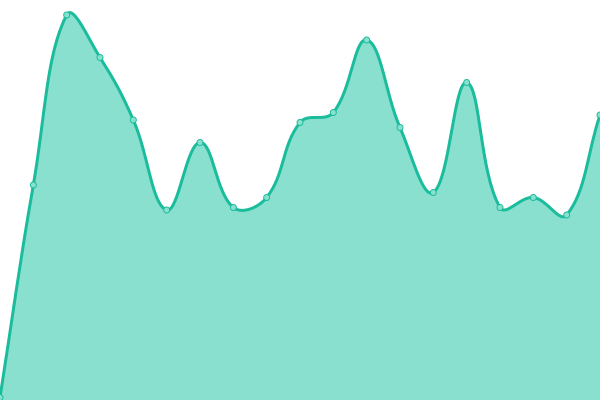
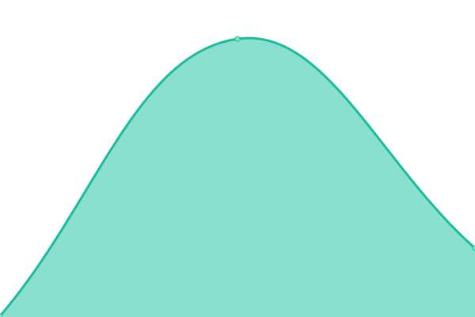

# [📈 Live Status](https://JonasSchaber.github.io/uptime): <!--live status--> **🟧 Partial outage**

This repository contains the open-source uptime monitor and status page for [JonasSchaber](https://JonasSchaber.github.io/uptime), powered by [Upptime](https://github.com/upptime/upptime).

With [Upptime](https://upptime.js.org), you can get your own unlimited and free uptime monitor and status page, powered entirely by a GitHub repository. We use [Issues](https://github.com/JonasSchaber/uptime/issues) as incident reports, [Actions](https://github.com/JonasSchaber/uptime/actions) as uptime monitors, and [Pages](https://JonasSchaber.github.io/uptime) for the status page.

<!--start: status pages-->
<!-- This summary is generated by Upptime (https://github.com/upptime/upptime) -->
<!-- Do not edit this manually, your changes will be overwritten -->
<!-- prettier-ignore -->
| URL | Status | History | Response Time | Uptime |
| --- | ------ | ------- | ------------- | ------ |
|  [IServ](https://gymall.de/iserv/) | 🟩 Up | [i-serv.yml](https://github.com/JonasSchaber/uptime/commits/HEAD/history/i-serv.yml) | 

 860ms
     
 | 

<a href="https://JonasSchaber.github.io/uptime/history/i-serv">100.00%</a>
    

|  [Moodle](moodle.gymall.de) | 🟩 Up | [moodle.yml](https://github.com/JonasSchaber/uptime/commits/HEAD/history/moodle.yml) | 

 2264ms
     
 | 

<a href="https://JonasSchaber.github.io/uptime/history/moodle">100.00%</a>
    

|  [Homepage](gymnasium-allermoehe.hamburg.de) | 🟩 Up | [homepage.yml](https://github.com/JonasSchaber/uptime/commits/HEAD/history/homepage.yml) | 

 2979ms
     
 | 

<a href="https://JonasSchaber.github.io/uptime/history/homepage">99.82%</a>
    

|  [Kunstgalerie](gymnasium-allermoehe.info) | 🟩 Up | [kunstgalerie.yml](https://github.com/JonasSchaber/uptime/commits/HEAD/history/kunstgalerie.yml) | 

 845ms
     
 | 

<a href="https://JonasSchaber.github.io/uptime/history/kunstgalerie">100.00%</a>
    

|  [Google](https://www.google.com/) | 🟩 Up | [google.yml](https://github.com/JonasSchaber/uptime/commits/HEAD/history/google.yml) | 

 107ms
     
 | 

<a href="https://JonasSchaber.github.io/uptime/history/google">100.00%</a>
    

|  [test](https://thissitedoesnotexist.com/) | 🟥 Down | [test.yml](https://github.com/JonasSchaber/uptime/commits/HEAD/history/test.yml) | 

 0ms
     
 | 

<a href="https://JonasSchaber.github.io/uptime/history/test">0.00%</a>
    

|  [test2](https://news.ycombinator.com/) | 🟩 Up | [test2.yml](https://github.com/JonasSchaber/uptime/commits/HEAD/history/test2.yml) | 

 192ms
     
 | 

<a href="https://JonasSchaber.github.io/uptime/history/test2">100.00%</a>
    

<!--end: status pages-->

[**Visit our status website →**](https://JonasSchaber.github.io/uptime)

## 📄 License

- Powered by: [Upptime](https://github.com/upptime/upptime)
- Code: [MIT](./LICENSE) © [JonasSchaber](https://JonasSchaber.github.io/uptime)
- Data in the `./history` directory: [Open Database License](https://opendatacommons.org/licenses/odbl/1-0/)
